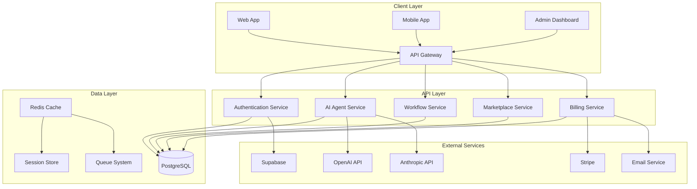

# AIAS Platform Architecture

This document provides a comprehensive overview of the AIAS Platform architecture, including system design, technology choices, and architectural decisions.

## 🏗️ System Overview

The AIAS Platform is a multi-tenant SaaS platform built with modern web technologies and designed for scalability, security, and maintainability.

### High-Level Architecture



## 🛠️ Technology Stack

### Frontend

- **React 18** - Modern UI library with hooks and concurrent features
- **Next.js 14** - Full-stack React framework with SSR/SSG
- **TypeScript** - Type-safe JavaScript with strict mode
- **Tailwind CSS** - Utility-first CSS framework
- **Radix UI** - Accessible component primitives
- **Framer Motion** - Animation library
- **React Query** - Data fetching and caching

### Backend

- **Node.js** - JavaScript runtime
- **TypeScript** - Type-safe backend development
- **Supabase** - Backend-as-a-Service platform
- **PostgreSQL** - Primary database
- **Redis** - Caching and session storage
- **BullMQ** - Job queue system

### AI & Integrations

- **OpenAI GPT-4/3.5** - Large language models
- **Anthropic Claude** - AI assistant
- **Google Gemini** - Multimodal AI
- **Custom Models** - Support for custom AI models

### Infrastructure

- **Docker** - Containerization
- **Kubernetes** - Container orchestration
- **Nginx** - Reverse proxy and load balancer
- **Prometheus** - Metrics collection
- **Grafana** - Monitoring dashboards
- **Sentry** - Error tracking

## 🏢 Multi-Tenant Architecture

### Tenant Isolation

The platform implements complete tenant isolation at multiple levels:

1. **Database Level**
   - Row-level security (RLS) policies
   - Tenant-specific schemas
   - Data encryption per tenant

2. **Application Level**
   - Tenant context middleware
   - Resource quotas and limits
   - Custom domain support

3. **Infrastructure Level**
   - Network segmentation
   - Resource isolation
   - Monitoring per tenant

### Tenant Management

```typescript
interface Tenant {
  id: string;
  name: string;
  subdomain: string;
  plan: 'starter' | 'professional' | 'enterprise';
  features: string[];
  limits: {
    workflows: number;
    executions: number;
    storage: number;
    users: number;
  };
  billing: {
    status: 'active' | 'suspended' | 'cancelled';
    nextBilling: Date;
    amount: number;
  };
}
```

## 🔒 Security Architecture

### Authentication & Authorization

- **Multi-Factor Authentication** - TOTP and SMS support
- **Role-Based Access Control** - Granular permissions
- **JWT Tokens** - Stateless authentication
- **Session Management** - Secure session handling

### Data Protection

- **Encryption at Rest** - AES-256 encryption
- **Encryption in Transit** - TLS 1.3
- **Key Management** - HSM integration
- **Data Residency** - Geographic data storage

### Security Monitoring

- **Real-time Threat Detection** - AI-powered analysis
- **Audit Logging** - Comprehensive activity tracking
- **Vulnerability Scanning** - Automated security scans
- **Incident Response** - Automated response procedures

## 📊 Data Architecture

### Database Design

```sql
-- Core Tables
CREATE TABLE tenants (
  id UUID PRIMARY KEY DEFAULT gen_random_uuid(),
  name TEXT NOT NULL,
  subdomain TEXT UNIQUE NOT NULL,
  plan_id UUID REFERENCES subscription_plans(id),
  status TEXT DEFAULT 'active',
  created_at TIMESTAMP WITH TIME ZONE DEFAULT NOW()
);

CREATE TABLE users (
  id UUID PRIMARY KEY DEFAULT gen_random_uuid(),
  tenant_id UUID REFERENCES tenants(id),
  email TEXT UNIQUE NOT NULL,
  name TEXT NOT NULL,
  role TEXT DEFAULT 'user',
  created_at TIMESTAMP WITH TIME ZONE DEFAULT NOW()
);

CREATE TABLE ai_agents (
  id UUID PRIMARY KEY DEFAULT gen_random_uuid(),
  tenant_id UUID REFERENCES tenants(id),
  name TEXT NOT NULL,
  description TEXT,
  model TEXT NOT NULL,
  config JSONB NOT NULL,
  created_at TIMESTAMP WITH TIME ZONE DEFAULT NOW()
);

CREATE TABLE workflows (
  id UUID PRIMARY KEY DEFAULT gen_random_uuid(),
  tenant_id UUID REFERENCES tenants(id),
  name TEXT NOT NULL,
  description TEXT,
  nodes JSONB NOT NULL,
  connections JSONB NOT NULL,
  status TEXT DEFAULT 'draft',
  created_at TIMESTAMP WITH TIME ZONE DEFAULT NOW()
);
```

### Caching Strategy

- **Redis Cache** - API response caching
- **CDN** - Static asset caching
- **Browser Cache** - Client-side caching
- **Database Query Cache** - Query result caching

## 🔄 Workflow Engine

### Workflow Definition

```typescript
interface WorkflowNode {
  id: string;
  type: 'trigger' | 'action' | 'condition' | 'ai_processing';
  position: { x: number; y: number };
  config: Record<string, any>;
  connections: string[];
}

interface Workflow {
  id: string;
  name: string;
  description: string;
  nodes: WorkflowNode[];
  status: 'draft' | 'active' | 'paused' | 'archived';
  created_at: Date;
  updated_at: Date;
}
```

### Execution Engine

- **Queue System** - BullMQ for workflow execution
- **Worker Processes** - Scalable worker architecture
- **Error Handling** - Comprehensive error recovery
- **Monitoring** - Real-time execution monitoring

## 🤖 AI Agent System

### Agent Architecture

```typescript
interface AIAgent {
  id: string;
  name: string;
  description: string;
  model: 'gpt-4' | 'claude-3' | 'gemini' | 'custom';
  config: {
    temperature: number;
    max_tokens: number;
    system_prompt: string;
    tools: string[];
  };
  training_data: string[];
  pricing: {
    type: 'per_use' | 'subscription' | 'one_time';
    amount: number;
  };
}
```

### Model Integration

- **OpenAI Integration** - GPT-4, GPT-3.5, DALL-E
- **Anthropic Integration** - Claude-3, Claude-2
- **Google Integration** - Gemini Pro, PaLM
- **Custom Models** - Support for custom AI models

## 💰 Billing & Monetization

### Subscription Tiers

```typescript
interface SubscriptionPlan {
  id: string;
  name: string;
  price_monthly: number;
  price_yearly: number;
  features: string[];
  limits: {
    workflows: number;
    executions: number;
    storage: number;
    users: number;
  };
}
```

### Payment Processing

- **Stripe Integration** - Payment processing
- **Webhook Handling** - Real-time payment updates
- **Usage Tracking** - Automated billing
- **Invoice Generation** - Automated invoicing

## 📈 Monitoring & Observability

### Metrics Collection

- **Application Metrics** - Custom business metrics
- **Infrastructure Metrics** - System performance metrics
- **User Metrics** - User behavior analytics
- **Security Metrics** - Security event metrics

### Logging Strategy

- **Structured Logging** - JSON-formatted logs
- **Log Aggregation** - Centralized logging
- **Log Analysis** - Real-time log analysis
- **Alerting** - Proactive alerting

### Dashboards

- **Business Dashboard** - Revenue and user metrics
- **Technical Dashboard** - System performance
- **Security Dashboard** - Security metrics
- **Custom Dashboards** - Tenant-specific dashboards

## 🚀 Deployment Architecture

### Container Strategy

- **Multi-stage Builds** - Optimized Docker images
- **Health Checks** - Container health monitoring
- **Resource Limits** - CPU and memory limits
- **Security Scanning** - Container vulnerability scanning

### Orchestration

- **Kubernetes** - Container orchestration
- **Helm Charts** - Application packaging
- **Service Mesh** - Istio for service communication
- **Auto-scaling** - Horizontal pod autoscaling

### CI/CD Pipeline

- **GitHub Actions** - Automated CI/CD
- **Quality Gates** - Automated quality checks
- **Security Scanning** - Automated security scans
- **Blue-Green Deployment** - Zero-downtime deployments

## 🔧 Development Architecture

### Code Organization

```
src/
├── components/          # Reusable UI components
├── pages/              # Next.js pages
├── hooks/              # Custom React hooks
├── lib/                # Utility functions
├── types/              # TypeScript type definitions
├── api/                # API routes
├── workers/            # Background workers
└── tests/              # Test files
```

### Package Structure

```
packages/
├── lib/                # Shared libraries
├── config/             # Shared configuration
├── ui/                 # UI component library
└── types/              # Shared type definitions
```

## 📚 API Architecture

### REST API Design

- **RESTful Endpoints** - Standard REST conventions
- **OpenAPI Specification** - API documentation
- **Rate Limiting** - API rate limiting
- **Authentication** - JWT-based authentication

### GraphQL API

- **Schema Definition** - Type-safe API
- **Query Optimization** - Efficient data fetching
- **Real-time Subscriptions** - WebSocket support
- **Caching** - Query result caching

## 🔮 Future Architecture

### Planned Improvements

- **Microservices** - Service decomposition
- **Event Sourcing** - Event-driven architecture
- **CQRS** - Command Query Responsibility Segregation
- **Blockchain Integration** - Immutable audit trails

### Scalability Considerations

- **Horizontal Scaling** - Multi-instance deployment
- **Database Sharding** - Data partitioning
- **CDN Integration** - Global content delivery
- **Edge Computing** - Edge deployment

## 📖 Additional Resources

- [API Documentation](../api/README.md)
- [Deployment Guide](../deployment/README.md)
- [Security Guide](../security/README.md)
- [Performance Guide](../performance/README.md)

---

This architecture provides a solid foundation for building a scalable, secure, and maintainable AI platform. For specific implementation details, refer to the individual component documentation.